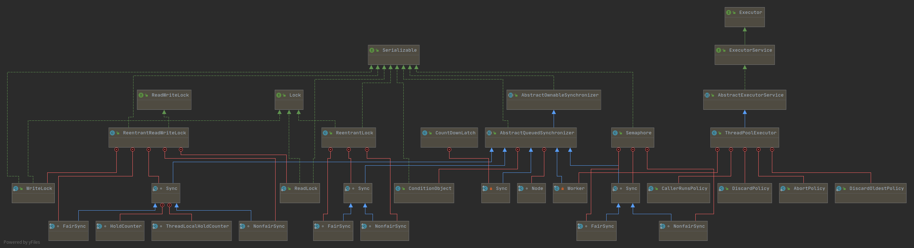
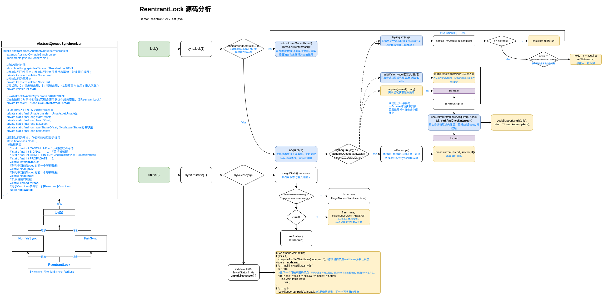
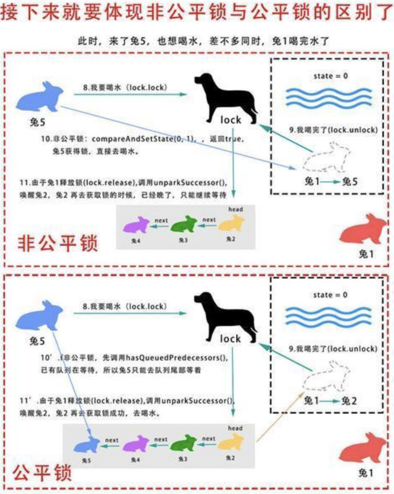

# 并发编程-AQS

> Provides a framework for implementing blocking locks and related synchronizers (semaphores, events, etc) 
> that rely on first-in-first-out (FIFO) wait queues.

AQS （AbstractQueuedSynchronizer，意为抽象的队列同步器），提供了一个依赖FIFO等待队列的框架用于实现阻塞锁和相关的同步器（信号量、事件等）。


## AQS体系

类图：



**JDK中AQS的子类**：

```java
FairSync in ReentrantLock
FairSync in ReentrantReadWriteLock
FairSync in Semaphore
NonfairSync in ReentrantLock
NonfairSync in ReentrantReadWriteLock
NonfairSync in Semaphore
Sync in CountDownLatch
Sync in ReentrantLock
Sync in ReentrantReadWriteLock
Sync in Semaphore
Worker in ThreadPoolExecutor
//公共类
ReentrantLock、ReentrantReadWriteLock、 Semaphore、CountDownLatch、ThreadPoolExecutor
```


### AQS数据结构

要点总结：

```java
public abstract class AbstractQueuedSynchronizer
    extends AbstractOwnableSynchronizer
    implements java.io.Serializable {
    
    //自旋超时时间
    static final long spinForTimeoutThreshold = 1000L;
    //等待队列的头节点（等待队列中存放等待获取锁并被唤醒的线程）
    private transient volatile Node head;
    //等待队列的尾节点
    private transient volatile Node tail;
    //锁状态，0：锁未被占用，1：锁被占用，>1:锁被重入占用（重入次数）
    private volatile int state;
    
    //从AbstractOwnableSynchronizer继承的属性
    //独占线程（对于排他锁的实现会使用到这个成员变量，如ReentrantLock）
    private transient Thread exclusiveOwnerThread;

    //CAS操作入口 及 各个属性的偏移量
    private static final Unsafe unsafe = Unsafe.getUnsafe();
    private static final long stateOffset;
    private static final long headOffset;
    private static final long tailOffset;
    private static final long waitStatusOffset;	//Node.waitStatus的偏移量
    private static final long nextOffset;

    //双向队列（FIFO）的节点，存储等待获取锁的线程
    static final class Node {
      	//线程状态
        // static final int CANCELLED =  1;		//线程取消等待
        // static final int SIGNAL    = -1;			  //等待被唤醒
        // static final int CONDITION = -2; 	//后面两种状态用于共享锁的控制
        // static final int PROPAGATE = -3;
        volatile int waitStatus;
        //队列中当前Noded的前一个等待线程
        volatile Node prev;
        //队列中当前Noded的前一个等待线程
        volatile Node next;
        //节点当前的线程
        volatile Thread thread;
        //用于Condition条件锁，如Reentrant$Condition
        Node nextWaiter;
    }
}
```


### AQS锁特点

+ **锁的实质**

  是一个volatile int 类型的共享变量state。volatile保证可见性和禁止指令重排序。

  ```java
  //锁状态，0：锁未被占用，1：锁被占用，>1:锁被重入占用（重入次数）
  private volatile int state;
  ```

+ **等待线程队列**

  AQS使用双向队列（FIFO）存储等待获取锁的线程。

  为何设计为双端队列：因为

  ```java
  private void unparkSuccessor(Node node) {
  	int ws = node.waitStatus;
      if (ws < 0)
          compareAndSetWaitStatus(node, ws, 0); //修改当前节点waitStatus为默认状态
      Node s = node.next;
      if (s == null || s.waitStatus > 0) {
          s = null;
          //查下一个可被唤醒的节点（从队列尾部开始往前查，因为next可能被置为空，但是prev一直存在）
          for (Node t = tail; t != null && t != node; t = t.prev)
              if (t.waitStatus <= 0)
                  s = t;
      }
      if (s != null)
          LockSupport.unpark(s.thread); //总是唤醒链表中下一个可唤醒的节点
  }
  ```

+ **共享/独占**

  

  共享锁如：CountDownLatch、Semaphore
  独占锁如：ReentrantLock

+ **公平/非公平**

  以ReentrantLock为例。

  state == 0 的情况下：
  都一样，即通过CAS state竞争获取锁。

  state>=1 的情况下：

  公平：新来的线程（可能多个）直接加入到队列；

  非公平：新来的线程和队列头部的线程进行竞争。

+ **可重入**

  通过 state (volatile int) 计数实现，0：锁未被占用，1：锁被占用，>1:锁被重入占用。

+ **允许中断**

  等待锁的线程和释放锁的线程的关系可以用下面代码简单表示，其中等待线程可以被中断（再后面的判断中被从队列中清除）退出等待。

  ```java
  @Test
  public void testLockSupport() throws InterruptedException {
      //等待锁的线程
      Thread t = new Thread(() -> {
          LockSupport.park(this);
          System.out.println("waiting ...");
          boolean interrupted = Thread.interrupted();
          System.out.println("interrupted: " + interrupted);
  
      });
      t.start();
  
      //释放锁的线程
      Thread.sleep(10);
      System.out.println("state: " + t.getState());
      //等待线程退出的方式1：等待线程被唤醒
      //LockSupport.unpark(t);
      //等待线程退出的方式2：等待线程被中断
      t.interrupt();
  
      t.join();
      System.out.println("done");
  }
  ```

  

## AQS实现类源码分析

### AQS锁实现

#### ReentrantLock

测试DEMO: ReentrantLockTest.java

源码分析参考流程图（之前写的文字总结感觉太乱了重新画了个流程图）。



##### ReentrantLock 公平锁和非公平锁

**都是state == 0** 的情况下：

都一样，即通过CAS state竞争获取锁。

**state >= 1** 的情况下：

**公平锁**：新来的线程（可能多个）直接加入到队列；

**非公平锁**：新来的线程和队列头部的线程进行竞争。

```java
//非公平锁尝试获取锁
final boolean nonfairTryAcquire(int acquires) {
    final Thread current = Thread.currentThread();
    int c = getState();
    if (c == 0) {
        if (compareAndSetState(0, acquires)) {	//ReentrantLock 公平锁和非公平锁的区别
            setExclusiveOwnerThread(current);
            return true;
        }
    }
    else if (current == getExclusiveOwnerThread()) {
        int nextc = c + acquires;
        if (nextc < 0) // overflow
            throw new Error("Maximum lock count exceeded");
        setState(nextc);
        return true;
    }
    return false;
}

//公平锁尝试获取锁
protected final boolean tryAcquire(int acquires) {
    final Thread current = Thread.currentThread();
    int c = getState();
    if (c == 0) {
        if (!hasQueuedPredecessors() &&
            compareAndSetState(0, acquires)) {	//!hasQueuedPredecessors()  公平锁多了这个判断
            									//即c线程入队后就不会再跟新线程抢锁了，只会排队等待唤醒
            setExclusiveOwnerThread(current);
            return true;
        }
    }
    else if (current == getExclusiveOwnerThread()) {
        int nextc = c + acquires;
        if (nextc < 0)
            throw new Error("Maximum lock count exceeded");
        setState(nextc);
        return true;
    }
    return false;
}
```

##### Condition原理

还是通过 waitStatus 和 LockSupport.park()和LockSupport.unpark()实现的，

await() 修改线程状态为 waitStatus 为 CONDITION = -2, 然后LockSupport.park()阻塞，加入队列；

signal()查看nextWaiter队列节点唤醒所有等待状态为CONDITION = -2的节点的线程。

```
final boolean transferForSignal(Node node) {
    if (!compareAndSetWaitStatus(node, Node.CONDITION, 0))
    return false;

    Node p = enq(node);
    int ws = p.waitStatus;
    if (ws > 0 || !compareAndSetWaitStatus(p, ws, Node.SIGNAL))
    LockSupport.unpark(node.thread);
    return true;
}
```

#### ReetrantReadWriteLock


#### Semaphore

工作原理：

１）调用acquire()方法，如果是非公平模式，内部先tryAcquireShared(1),即CAS尝试获取共享锁，成功的话共享锁计数减１，返回剩余锁计数。

２）如果锁计数>＝0，则说明当前线程成功获取共享锁，当前线程开始处理业务逻辑;　如果锁计数小于0，说明锁不再可被获取，执行doAcquireSharedInterruptibly()将当前线程放入到Semaphore AQS的等待队列（如果等待队列为空则新建，并使用Node.SHARED作为头节点，将当前节点放置在头节点后，作为tail节点）中。进入队列后会先自旋，若前驱节点为head节点则再次尝试获取共享锁；否则则LockSupport.park()阻塞等待。

```java
AbstractQueuedSynchronizer$doAcquireSharedInterruptibly()
  //默认有个叫Node.SHARED的节点（作为队列初始头节点和尾节点），将当前线程的节点插入到尾节点后
  //并当前线程节点nextWaiter指针指向前一个节点.TODO: nextWaiter?
  AbstractQueuedSynchronizer$addWaiter()
  for(;;) {
    //获取前驱节点
	//如果前驱节点是head节点，则当前线程尝试获取共享锁，成功则将当前节点设置为head,
    //如果前驱不是head节点，则阻塞
  }
```

３）当之前获取锁的线程执行完业务释放共享锁，则会增加共享锁可用计数，然后获取头节点，如果头节点后面还有节点，并且节点状态是Node.SIGNAL则LockSupport.unpark()唤醒此节点。

４）之前睡眠的线程被唤醒后继续自旋尝试获取共享锁，这次可以成功获取，获取之后将自己设置为head节点,然后连带着唤醒后面的线程，后面的线程自旋尝试获取锁，自己则去执行自己的业务逻辑。

#### CountDownLatch

#### CyclicBarrier

`CyclicBrrier`是同步屏障，用于控制多线程同时开始执行任务。

工作原理：  
基于`Condition`的等待唤醒机制(刚开始猜想是Object wait() notifyAll(),这种应该也是可以实现的)；  
１）设置同步屏障参与的线程数量（作为未准备就绪计数 count）；  
２）前面就绪(count--,表示自己已经就绪)的线程阻塞等待条件(就绪即开始执行任务前调用Condition$await()方法）；  
３）最后一个准备就绪的线程（count--后等于０）执行条件唤醒`Condition$notifyAll()`,唤醒所有线程；同时还需要注意它还会重置count计数和generation标志也既是说可以还可以进行下一轮的“比赛”。  

同时：  
实现中还有一些细节，这里分开说（以往分析源码喜欢将主要逻辑和细节问题放在一起说，陈述罗嗦，让人迷惑，而且对于大框架细节总是探索不玩浪费时间，还影响主要逻辑分析的推进）。  
１）同步计数等值需要使用同步器等措施保证线程安全;  
２）某线程执行异常需要在后置处理中通知其他就绪的线程退出等待；  
３）还有线程被中断的处理、超时处理（比较简单不多加陈述）。  

测试代码:  
`top.kwseeker.concurrency.juclock.CyclicBarrier`。

### 锁公平性的理解

看源码实现发现之前对**非公平锁**理解有偏差：非公平锁并不是锁释放后，队列中的各个等待线程全部参与竞争，而是队列头部等待线程和其他刚过来请求加锁的线程进行竞争。还有在队列中的线程也不一定按照队列的顺序获取锁，如果中间碰到一个无效的节点（被cancel的节点），则会从尾节点开始往前找。

别人画了张图很形象（但是没有包含碰到线程被cancel的节点情况）：



