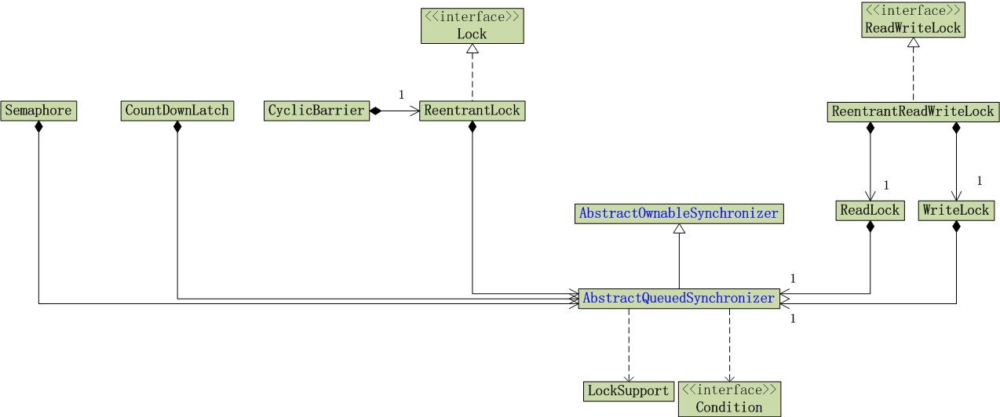

# 并发编程-AQS

AQS是一个抽象同步框架，可以用来实现一个依赖线程状态的同步器。JUC中众多的同步器都是通过AQS实现的。

## AQS架构

类图：



### 锁数据结构

每一个AQS的实现类的实例都是锁对象。

**AbstractQueuedSynchronizer**，定义锁基本数据和操作。

```java
//提供CAS操作支持
unsafe: Unsafe
stateOffset: long
//锁状态，0：锁未被占用，1：锁被占用，>1:锁被重入占用
state: volatile int
//独占线程（对于独占锁的实现会使用到这个成员变量，如ReentrantLock）
exclusiveOwnerThread -> AbstractOwnableSynchronizer  
//等待获取锁的线程节点的等待队列
head: Node
headOffset
tail: Node
tailOffset
nextOffset
spinForTimeoutThreshold
```
**Node**: 阻塞队列的节点，存储等待获取锁的线程。

```java
waitStatus: volatile int	//等待状态：线程被cancelled、等待unpark()唤醒、等待条件唤醒
nextWaiter: Node			//用于Condition条件锁，如Reentrant#Condition
prev: volatile Node			//阻塞队列中当前节点的前一个等待获取锁的线程的节点
next: volatile Node			//阻塞队列中当前节点的后一个等待获取锁的线程的节点
thread: volatile Thread		//等待获取锁的线程
```
**state**：等待状态

```java
/** waitStatus value to indicate thread has cancelled */
static final int CANCELLED =  1;
/** waitStatus value to indicate successor's thread needs unparking */
static final int SIGNAL    = -1;
//后面两种状态用于共享锁的控制
/** waitStatus value to indicate thread is waiting on condition */
static final int CONDITION = -2;
/**
* waitStatus value to indicate the next acquireShared should
* unconditionally propagate */
static final int PROPAGATE = -3;
```

### AQS锁特性

+ **阻塞等待队列**

  AQS使用阻塞等待队列存储等待获取锁的线程。

  + 同步等待队列
  + 条件等待队列

+ **共享/独占**

  共享锁如：CountDownLatch、Semaphore
  独占锁如：ReentrantLock

+ **公平/非公平**

  公平锁实现需要先判断队列是否为空，不为空直接创建节点加入到队尾；非公平锁实现先尝试获取锁，失败的话再加入队尾。

+ **可重入**

  通过 state (volatile int) 计数实现，0：锁未被占用，1：锁被占用，>1:锁被重入占用。

+ **允许中断**


## AQS实现类源码分析

### AQS锁实现

#### ReentrantLock

类似排队买东西的生活场景。

##### 以ReentrantLock的测试开始调试分析

```
public class ReentrantLockTest {
    private int count = 0;
    @Test
    public void testReentrantLock() {
        ReentrantLock lock = new ReentrantLock(); //1
        for (int i = 0; i < 3; i++) {
            new Thread(()->{
                lock.lock();  //2
                count++;
                lock.unlock();  //3
            }).start();
        }
        while (Thread.activeCount() > 2) {}
        System.out.println(count);
    }
}
```

##### 多个线程并发加锁释放锁流程

  1) 线程A通过Unsafe CAS 比较当前锁对象成员变量state的值是否为0(未被占用)，是的话更新为1(被占用)。更新成功的话，设置独占线程exclusiveOwnerThread为当前线程。然后执行同步块，断点暂停。

  2) 假如又一个线程B加锁执行CAS比较当前锁对象成员变量state的值是否为0，这次肯定失败返回false；执行AbstractQueuedSynchronizer$acquire(int arg)[这个方法在ReentrantLock#NonfairSync中实现]，这个方法内部先读取锁的state值，看看是否为0（即锁有没有释放），释放了则执行第一步的逻辑，没有释放的话，读取当前锁被哪个线程独占，看是不是自己；是自己的话说明是重入加锁，将state值+1；否则返回获取锁失败。

  3) 线程B tryAcquire 失败后，创建新的等待节点[记录当前线程实例到thread成员变量和占锁模式到nextWaiter成员变量，ReentrantLock为独占模式：Node.EXCLUSIVE]加入锁的等待队列。

  4) 线程B会在一个循环中等待被唤醒，占用锁的线程释放锁会唤醒队列中下一个等待状态中的线程。
      ```java
for (;;) {
    final Node p = node.predecessor();
    if (p == head && tryAcquire(arg)) {
        setHead(node);
        p.next = null; // help GC
        failed = false;
        return interrupted;
    }
    if (shouldParkAfterFailedAcquire(p, node) &&
        parkAndCheckInterrupt())  //这里面调用 LockSupport.park()进入等待
        interrupted = true;
}
      ```

  5) 线程A执行完同步块代码然后释放锁lock.unlock(), 执行AbstractQueuedSynchronizer$release()；先执行 Sync$tryRelease(),先检查占锁的线程是否为当前线程，然后因为锁是可重入的需要判断state减1是否为0，不为0说明还不能释放锁，这时只会将state值减一。如果tryRelease()执行成功说明真是需要释放锁了，判断head.next节点的waitStatus值，根据值做对应处理。1：直接从队列删除head.next节点；-1：唤醒head.next节点的线程；-2：条件处理。

##### Condition原理

还是通过 waitStatus 和 LockSupport.park()和LockSupport.unpark()实现的，

await() 修改线程状态为 waitStatus 为 CONDITION = -2, 然后LockSupport.park()阻塞，加入队列；

signal()查看nextWaiter队列节点唤醒所有等待状态为CONDITION = -2的节点的线程。

```
final boolean transferForSignal(Node node) {
    if (!compareAndSetWaitStatus(node, Node.CONDITION, 0))
    return false;

    Node p = enq(node);
    int ws = p.waitStatus;
    if (ws > 0 || !compareAndSetWaitStatus(p, ws, Node.SIGNAL))
    LockSupport.unpark(node.thread);
    return true;
}
```

#### ReetrantReadWriteLock

#### Semaphore

工作原理：

１）调用acquire()方法，如果是非公平模式，内部先tryAcquireShared(1),即CAS尝试获取共享锁，成功的话共享锁计数减１，返回剩余锁计数。

２）如果锁计数>＝0，则说明当前线程成功获取共享锁，当前线程开始处理业务逻辑;　如果锁计数小于0，说明锁不再可被获取，执行doAcquireSharedInterruptibly()将当前线程放入到Semaphore AQS的等待队列（如果等待队列为空则新建，并使用Node.SHARED作为头节点，将当前节点放置在头节点后，作为tail节点）中。进入队列后会先自旋，若前驱节点为head节点则再次尝试获取共享锁；否则则LockSupport.park()阻塞等待。

```java
AbstractQueuedSynchronizer$doAcquireSharedInterruptibly()
  //默认有个叫Node.SHARED的节点（作为队列初始头节点和尾节点），将当前线程的节点插入到尾节点后
  //并当前线程节点nextWaiter指针指向前一个节点.TODO: nextWaiter?
  AbstractQueuedSynchronizer$addWaiter()
  for(;;) {
    //获取前驱节点
	//如果前驱节点是head节点，则当前线程尝试获取共享锁，成功则将当前节点设置为head,
    //如果前驱不是head节点，则阻塞
  }
```

３）当之前获取锁的线程执行完业务释放共享锁，则会增加共享锁可用计数，然后获取头节点，如果头节点后面还有节点，并且节点状态是Node.SIGNAL则LockSupport.unpark()唤醒此节点。

４）之前睡眠的线程被唤醒后继续自旋尝试获取共享锁，这次可以成功获取，获取之后将自己设置为head节点,然后连带着唤醒后面的线程，后面的线程自旋尝试获取锁，自己则去执行自己的业务逻辑。

#### CountDownLatch

#### CyclicBarrier

`CyclicBrrier`是同步屏障，用于控制多线程同时开始执行任务。

工作原理：  
基于`Condition`的等待唤醒机制(刚开始猜想是Object wait() notifyAll(),这种应该也是可以实现的)；  
１）设置同步屏障参与的线程数量（作为未准备就绪计数 count）；  
２）前面就绪(count--,表示自己已经就绪)的线程阻塞等待条件(就绪即开始执行任务前调用Condition$await()方法）；  
３）最后一个准备就绪的线程（count--后等于０）执行条件唤醒`Condition$notifyAll()`,唤醒所有线程；同时还需要注意它还会重置count计数和generation标志也既是说可以还可以进行下一轮的“比赛”。  

同时：  
实现中还有一些细节，这里分开说（以往分析源码喜欢将主要逻辑和细节问题放在一起说，陈述罗嗦，让人迷惑，而且对于大框架细节总是探索不玩浪费时间，还影响主要逻辑分析的推进）。  
１）同步计数等值需要使用同步器等措施保证线程安全;  
２）某线程执行异常需要在后置处理中通知其他就绪的线程退出等待；  
３）还有线程被中断的处理、超时处理（比较简单不多加陈述）。  

测试代码:  
`top.kwseeker.concurrency.juclock.CyclicBarrier`。

### 锁公平性的理解

看源码实现发现之前对**非公平锁**理解有偏差：非公平锁并不是锁释放后，队列中的各个等待线程全部参与竞争，而是队列头部等待线程和其他刚过来请求加锁的线程进行竞争。还有在队列中的线程也不一定按照队列的顺序获取锁，如果中间碰到一个无效的节点（被cancel的节点），则会从尾节点开始往前找。

别人画了张图很形象（但是没有包含碰到线程被cancel的节点情况）：


