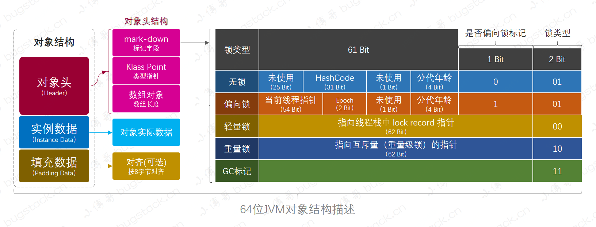

# 再看锁synchronized、ReentrantLock与并发特性

+ synchronzied 和 ReentrantLock 都可以保证原子性和可见性（原子性也称为互斥性）

  > 原子性通俗理解是原子操作不可以被多个线程同时执行，只有一个线程执行完，另一个线程才能执行这个操作；
  >
  > synchronzied 可以保证原子性借助监视器对象（ObjectMonitor）`_owner、_count、_WaitSet、_EntryList`实现；
  >
  > ​	当修饰方法时，编译器会生成 ACC_SYNCHRONIZED 关键字用来标识需要竞争监视器对象，
  >
  > ​	当修饰代码块时，会依赖monitorenter和monitorexit指令去竞争监视器对象。
  >
  > ​	当synchronized 升级为重量级锁时，锁住的对象的**对象头**中**MarkWord**的高62位存放 ObjectMonitor 的引用。
  >
  > ​	如果synchronized修饰的是实例方法，对应的锁则是对象实例
  >
  > ​	如果synchronized修饰的是静态方法，对应的锁则是当前类的Class实例
  >
  > ​	如果synchronized修饰的是代码块，对应的锁则是传入synchronized的对象实例
  >
  > ReentrantLock 可以保证原子性是借助 AQS `volatile state + CLH` （CLH是论文三个作者名字的首字母）队列实现。
  >
  > 其实他们的实现原理有一定的相似性，都有占用状态和等待队列：
  >
  > + 占用状态
  >
  >   ObjectMonitor `_owner、_count` 与 AQS `volatile state`。
  >
  > + 等待队列
  >
  >   ObjectMonitor `_WaitSet、_EntryList` 与 AQS `CLH`。
  >
  > 
  >
  > synchronzied 可以保证可见性是因为 Java 内存模型中规定 synchronized 加锁与释放锁的流程：
  >
  > ​	加锁前，清空线程工作内存 -> 加锁后 -> （读）从主内存中重新读取最新的值 -> （写）修改共享变量的值 -> 释放锁前，将修改后的共享变量刷新到主内存 -> 释放锁。
  >
  > ReentrantLock 可以保证可见性是因为内部使用AQS volatile state 记录锁的状态，间接借助 volatile 实现了可见性；
  >
  > ​	具体是因为在ReentrantLock lock.lock() 和 lock.unlock() 时，都会修改 AQS类 中的变量 state，这个变量是 volatile 修饰的，volatile变量的语句对应的汇编指令中会多加一行 `lock addl $0x0, (%esp)`（注意是汇编指令不是字节码指令），这一行的作用是：
  >
  > ​	1）将工作内存修改了的缓存（不仅仅是该变量（state）的缓存）都强制刷新回主内存
  >
  > ​	2）把其他CPU对应缓存行标记为invalid状态，那么在读取这一部分缓存时，必须回主内存读取。
  >
  > ​	这样也就保证了线程间的可见性。

## synchoronzied 工作原理

注意 ObjectMonitor 仅仅只有当锁升级到重量级锁才会使用。

重量级锁ObjectMonitor基于操作系统的 mutex 等指令，需要经过系统调用调用指令，会产生用户态和内核态之间的切换，性能损耗严重。

JDK1.6 之前都是重量级锁。

### 锁升级（锁膨胀）

膨胀方向是：无锁 —> 偏向锁 —> 轻量级锁 —> 重量级锁。

下图中标记字段有错误，应该是MarkWord。

1）初始为**无锁**状态；

2）当有一个线程A请求获取锁，MarkWord 通过 CAS 操作记录当前获取锁的线程ID（高54bits），成功则更新其他字段，相当于获取到**偏向锁**，然后执行同步代码块；

> 偏向锁的思想：
>
> 认为大多数情况同时只有一个线程请求锁（即没有竞争场景），只有一个线程请求锁时只需要记录占用锁的线程ID，这个记录其实为了万一出现竞争给锁升级用的。

3）线程A获取锁后，可能直到同步代码块执行完成都没有其他线程请求锁，但是这时偏向锁并不会解锁（即不会清除记录的线程ID）; 

4）线程A获取锁后，如果有线程B请求获取锁，这时发现偏向锁记录着其他线程ID，通过CAS修改线程ID，会失败，这时会等待线程A到达安全点后暂停线程A并检查线程A的状态，

5）线程A如果处于未活动或已退出同步代码块，才会释放偏向锁（线程ID记录设置为空、偏向锁标记置为0），线程B之后再次CAS尝试获取锁可能获取成功；

6）线程A如果还处于活动状态且未退出同步代码块，则说明出现了竞争，这时需要升级为**轻量级锁**；在原持有偏向锁的线程栈中分配锁记录（LockRecord），并将原 MarkWord 保存到锁记录，MarkWord高62位则更新为锁记录的引用，MarkWord锁类型设置为轻量级锁（00），这相当于原持有偏向锁的线程现在持有轻量级锁；

> 轻量级锁的思想：
>
> 认为竞争不激烈，认为只需要稍微等待一小会儿就会获取到锁，认为根本不需要像重量级锁那样挂起线程；

7）线程A被唤醒从安全点继续执行，执行完毕进行轻量级锁解锁；

8）线程B也在自己的栈中分配锁记录，并拷贝MarkWord到自己的锁记录，这时锁记录中是线程A锁记录的引用；

9）线程B尝试通过CAS将MarkWord的锁记录引用改为线程B的锁记录引用；如果线程A还没释放锁，这里CAS会失败，失败的话线程B就自旋几次，重新尝试CAS操作，如果成功则获取到轻量级锁，如果失败（可能被其他线程C、也可能线程A抢占）说明竞争激烈，自旋已经无法获取到锁了还可能浪费很多CPU资源，就需要升级为**重量级锁**；将MarkWord高62位则更新为ObjectMonitor对象的引用。

总结：

其实和乐观锁的思想类似，不过synchronized刚开始更加乐观，刚开始甚至认为同时只有一个线程请求锁；当发现多个线程同时请求锁才升级到轻量级锁，升级到轻量级锁后依然乐观，认为只需要短暂自旋等待就可以很快获取到锁；只有发现自旋超时还没获取到锁才承认竞争确实激烈，才会选择使用基于操作系统Mutex机制的重量级锁。

### 锁消除

锁削除是指虚拟机即时编译器在运行时，对一些代码上要求同步，但是被检测到不可能存在共享数据竞争的锁进行削除。

### 锁粗化

锁粗化就是将多个连续的加锁、解锁操作连接在一起，扩展成一个范围更大的锁。

在使用同步锁的时候，需要让同步块的作用范围尽可能小—仅在共享数据的实际作用域中才进行同步，这样做的目的是 为了使需要同步的操作数量尽可能缩小，如果存在锁竞争，那么等待锁的线程也能尽快拿到锁。但是如果一系列的连续加锁解锁操作，可能会导致不必要的性能损耗，所以引入锁粗话的概念。

## 参考：

+ 《深入理解Java虚拟机》C12.3
+ [synchronized工作原理(一)](https://cloud.tencent.com/developer/article/1596138)
+ [码农会锁，synchronized 解毒，剖析源码深度分析！](https://bugstack.cn/md/java/interview/2020-10-28-%E9%9D%A2%E7%BB%8F%E6%89%8B%E5%86%8C%20%C2%B7%20%E7%AC%AC15%E7%AF%87%E3%80%8A%E7%A0%81%E5%86%9C%E4%BC%9A%E9%94%81%EF%BC%8Csynchronized%20%E8%A7%A3%E6%AF%92%EF%BC%8C%E5%89%96%E6%9E%90%E6%BA%90%E7%A0%81%E6%B7%B1%E5%BA%A6%E5%88%86%E6%9E%90%EF%BC%81%E3%80%8B.html)

+ [synchronized的特性](https://www.cnblogs.com/yuarvin/p/14750553.html#/)