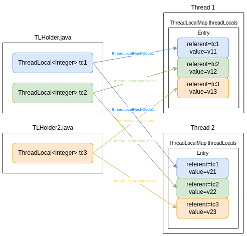

# ThreadLocal

这里回头再总结下ThreadLocal实现原理，并归纳学习工作中看到的ThreadLocal相关的应用场景（框架源码中很常见）。

**目录**：

+ ThreadLocal
  + SuppliedThreadLocal
  + ThreadLocalMap
  + ThreadLocal如何借助弱引用解决内存泄漏问题
  + ThreadLocal使用注意事项
+ InheritableThreadLocal

+ ThreadLocal在源码中的应用

  + JDK
    + ThreadLocalRandom并发高性能随机数生成器
  + spring-tx
    + 

  + Netty
    + FastThreadLocal (还改进了)
  + 日志
    + 链路追踪
  + ...

+ 工作中的使用

  + 拓展传参

  + Web会话共享
  + 使用ThreadLocal解决SimpleDateFormat线程安全问题


## ThreadLocal

关于ThreadLocal的官方描述：

ThreadLocal instances are typically private static fields in classes that wish to associate state with a thread (e.g., a user ID or Transaction ID).

即：ThreadLocal实例通常是**希望将状态与线程相关联（例如，用户ID或事务ID）的类中的私有静态字段**。

> 结合后面的原理，基本就已经说明了ThreadLocal应该怎么使用（代码怎么写）？如：
>
> ```java
> //参考SimplestExample.java
> public class TLHolder {	//TLHolder可能不是单独一个类而是跟业务放在一起
>     //私有静态字段（为何定义成私有静态主要取决于应用场景，但不是强制）
>     private static final ThreadLocal<Integer> tc = ThreadLocal.withInitial(() -> 0);
> 	...定义public的读写清除等方法...
> }
> ```
>
> 包括后面各种框架源码中的基本都是这么用的。TODO

**核心原理**：



Thread对象内部维持了一个**ThreadLocalMap**(是个哈希桶[数组])，key是TLHolder.tc实例（即代码中声明的ThreadLocal对象），通过它的哈希码&桶容量求得的索引（TLHolder.tc相当于一个门面，绑定到线程内部的ThreadLocalMap），value是线程独享的变量（存储在**ThreadLocalMap.Entry<T>**类型的value字段）。向ThreadLocal中存取数据时接口方法会**隐式获取当前线程实例**，再获取当前线程实例的ThreadLocalMap，再结合门面的hashcode&桶容量求的索引值进而获取当前线程中与门面绑定的要操作的**独享变量**对应引用，最终进行读写。

```java
//Thread.java
ThreadLocal.ThreadLocalMap threadLocals = null;
void createMap(Thread t, T firstValue) {
    t.threadLocals = new ThreadLocalMap(this, firstValue);
}
//ThreadLocal.java
class Entry extends WeakReference<ThreadLocal<?>>
```

核心原理很简单，但是还有一些重要细节：

比如：

+ **怎么解决hash冲突的**？

  和HashMap不同（拉链法），ThreadLocal用的线性探测（又叫开放地址法）的方法。

+ **为何Thread的threadLocalHashCode计算时的增量是0x61c88647？**

  ```
  private final int threadLocalHashCode = nextHashCode();
  private static int nextHashCode() {
      return nextHashCode.getAndAdd(HASH_INCREMENT);
  }
  private static AtomicInteger nextHashCode =  new AtomicInteger();
  private static final int HASH_INCREMENT = 0x61c88647;
  ```

  有资料说这个值和斐波那契散列有关（这是一种乘数散列法，只不过这个乘数比较特殊，是32位整型上限2^32-1乘以黄金分割比例0.618…的值2654435769，用有符号整型表示就是-1640531527，去掉符号后16进制表示为0x61c88647），其主要目的就是为了让哈希码能均匀的分布在2的n次方的数组里, 也就是Entry[] table中，这样做可以尽量避免hash冲突。

  > 什么数学原理？

+ **Entry为何定义为弱引用？**

  见后文分析。

### SuppliedThreadLocal

覆写了**initialValue()**方法，通过函数式对象**Supplier**初始化初始值。

### ThreadLocalMap

是一个哈希桶，初始容量是16。

Entry是ThreadLocal类型的弱引用（下次GC时会被回收）。

```java
static class ThreadLocalMap {
    static class Entry extends WeakReference<ThreadLocal<?>> {
        /** The value associated with this ThreadLocal. */
        Object value;

        Entry(ThreadLocal<?> k, Object v) {
            super(k);
            value = v;
        }
    }
    
	private static final int INITIAL_CAPACITY = 16;
	private Entry[] table;
    ...
}
```

### ThreadLocal如何借助弱引用解决内存泄漏问题

先看下ThreadLocal.remove()方法。先获取当前线程实例，然后获取threadLocal对应到线程内部ThreadLocalMap的位置，如下

```java
//ThreadLocalMap.java
private void remove(ThreadLocal<?> key) {
    Entry[] tab = table;
    int len = tab.length;
    int i = key.threadLocalHashCode & (len-1);	//初始索引
    for (Entry e = tab[i];
         e != null;
         e = tab[i = nextIndex(i, len)]) {	//线性探测寻址
        if (e.get() == key) {				//比较key，e.get()获取的是软引用内部的referent
            e.clear();						//将弱引用中的强引用释放
            expungeStaleEntry(i);			//后面的元素往前移，把刚空出的位置再填上
            return;
        }
    }
}
//Reference.java 将弱引用中的强引用对象释放
public void clear() {
    this.referent = null;
}
```

注意这里内存泄漏是说**如果释放了ThreadLocal实例但是不手动调用ThreadLocal$remove()方法，那么此ThreadLocal实例之前set的值会随着Thread的存在一直存在**。

而根据下面代码知道key（软引用内部的referent）也是软引用，那么就有个好处即**在释放ThreadLocal实例但是没有调用ThreadLocal$remove()方法的情况下，这个位置的value还是可以在下一次get()、set()、remove()时释放**。

```java
Entry(ThreadLocal<?> k, Object v) {
    super(k);	//k是ThreadLocal门面对象,super(k)即内部referent=k,即key也是软引用，释放ThreadLocal实例后key就变成null了
    value = v;
}
```

验证上面k没有强引用后，下次GC可以被自动回收。

```java
public class Entry extends WeakReference<Object> {

    public Entry(Object referent) {
        super(referent);
    }

    public static void main(String[] args) throws InterruptedException {
        Entry wrs = new Entry(new Object());
        System.out.println(wrs.get());
        System.gc();
        Thread.sleep(100);
        System.out.println(wrs.get());  //referent == null
    }
}
```

### ThreadLocal使用注意事项

+ 线程的ThreadLocal本地变量不用后都手动remove()下

  尽管有软引用的存在下并不会出现什么大问题，但是万一建了很多ThreadLocal，只是释放了引用没调remove()，且后面也没有remove()等操作，这部分内存还是会一直占着空间。

+ 小心线程复用（线程池）

  使用ThreadLocal的业务处理需要在一个任务中执行完毕，不可以跨线程。


## InheritableThreadLocal

InheritableThreadLocal 支持**在线程切换时传递父线程的上下文到子线程中**。不能反向传递、一旦传递完成不再受到父线程修改影响，但是注意传递的过程不是线程安全的，具体参考`ThreadLocalMap(ThreadLocalMap parentMap)`的源码，并没有并发控制。

InheritableThreadLocal 和 ThreadLocal 的主要区别是一个用的Thread的 inheritableThreadLocals，一个用的 threadLocals。主要就是多了个继承传递的操作，是在Thread中实现的，线程初始化时拷贝父线程inheritableThreadLocals，线程退出时清除。

```java
private void init(ThreadGroup g, Runnable target, String name,
                      long stackSize, AccessControlContext acc,
                      boolean inheritThreadLocals) {
    ...
    if (inheritThreadLocals && parent.inheritableThreadLocals != null)
        //遍历父线程inheritableThreadLocals的值拷贝到自己的inheritableThreadLocals
        this.inheritableThreadLocals =
        	ThreadLocal.createInheritedMap(parent.inheritableThreadLocals);
    ...
}
private void exit() {
    ...
    inheritableThreadLocals = null;
	...
}
```

**InheritableThreadLocal传递时非线程安全**。

比如线程 B C 分别先后继承线程A, 而A的InheritableThreadLocal值在期间不断变化，这就会导致B C 继承的值不同。

而 InheritableThreadLocal 使用场景一般应该保证这个传递的值是**不可变**的。

**InheritableThreadLocal的一个经典的使用场景是链路追踪**。


## ThreadLocal在框架源码中的应用

### JDK

#### ThreadLocalRandom并发高性能随机数生成器

#### NIO


### Spring-TX

### Netty

+ FastThreadLocal (还改进了)

### 日志

+ 链路追踪


## 工作中的使用

+ 线程级别实现Web会话共享

+ 请求拓展传参

  请求里面临时需要传递额外特殊的参数，但是不想改既有的参数类。

+ 使用ThreadLocal解决SimpleDateFormat线程安全问题